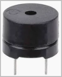

# Pico


# Project Title

Electronique 2 - Projet - Pico W application

## Table of Contents

- [Introduction](#introduction)
- [Features](#features)
- [Installation](#installation)
- [Usage](#usage)
- [Contributing](#contributing)

## Introduction

This is a group project from Ephec students in TI2, Electronics2

## Features

- implement several functionalities on a Raspberry Pi Pico W
- monitor a temperature sensor and display it on a 2 digit 7-segment
    - use 2 SN74LS47N to drive the 7-segment digits
- when temperature is above MAX, activate fan until it's down below MAX-1
    - a simple 5v fan (DC motor) is used
    - a relay is used to ensure enough power can be given to the fan
    - (an extra power source is added to the Pico 5V source from the USB cable (or battery))
- a web server on the Pico allows to
    - consult that state of the system (temperature, etc)
    - manually control the fan (ON, OFF)
    - the MAX value can be updated with the web interface
- optional
    - implement an LCD 1602 display to show additional information
    - buzzer when temperature above MAX
    - vary the fan speed depending on the temperature
    - etc


## GitHub repository

https://github.com/MonsieurLoki/Pico

To install (first time):

```bash
# Sample installation steps
git clone https://github.com/MonsieurLoki/Pico
cd Pico
```

To update the code :

```bash
# Sample steps
lfjdlflf
sldfsdjlfsdjf
```

# Tasks

Done
- describe project and features
- test components individually
    - dht-11 (temperature sensor)
    - pmod5hb (HBridge driver for a DC motor)
        - fan working
        - speed can be adjusted

    - buzzer

        
- create github repository
- create first version PCB

Todo
- make sure all group members have access to the github repo
- check everything (project, features, components, PBC, etc)
- in particular, check PCB 
    - schematic : check that each  component individually is connected properly (VCC, GND, GPIO)
    - board : check that all connections are done properly (top and bottom connections)
    - ...
- test components individually
    - 7-segments led + 74LS47
    - LCD1602 display
    - onboard temperature sensor
    - ADC (with variable resistor - potentiometer)


# PCB

To be put on the PCB :
- Pico W
- DHT-11 sensor
    - GPIO 0 
    - VCC (3V3)
    - GND
- fan relay
    - GPIO 1
    - VCC (3V3)
    - GND
- 2x 7-segments DIGIT
    - 7 connections to SN74LS47
    - GND
- SN74LS47N nr 1
    - 7 connections to 7-segment
    - GPIO 2, 3, 4, 5 : 4 bits -> 1 digit
    - BI/RBO, RBI, LT connected together
- SN74LS47N nr 2
    - 7 connections to 7-segment
    - GPIO 6, 7, 8, 9 : 4 bits -> 1 digit
    - BI/RBO, RBI, LT connected together
- buzzer
    - GPIO 10
    - GND
- variable resistor
    - VCC
    - GND
    - GPIO
optional


## Usage

Ipsum lorem...

```bash
test
test
```

## Contributing

Ephec Students
- Gaspard
- ...
